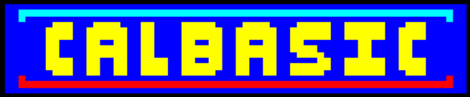

# CalBASIC



A... basic BASIC interpreter written in Go.
This is my own flavour of BASIC, and can be experimented with by visiting https://calluml.xyz/?program=basic.

## How it works
Whilst the 'proper' way to parse languages today is to use an Abstract Syntax Tree, this is more of a toy project primarily intended for fun. The way it works is simply to parse the program token by token and recursively evaluate them. That is to say, for the statement

`10 PRINT 3+ABS(5*-7)`

The program will be interpreted like so:
```
-> PRINT
-> EVALUATE NEXT STATEMENT: 3+ABS(5*-7)
--> 3 LITERAL
--> + OPERATOR
--> EVALUATE NEXT STATEMENT: ABS(5*-7)
---> ABS
---> EVALUATE NEXT STATEMENT: 5*-7
----> 5 LITERAL
----> * OPERATOR
----> EVALUATE NEXT STATEMENT: -7
-----> -7 LITERAL
----> 5*-7 = -35
---> ABS (-35) = 35
--> 3 + 35 = 38
-> PRINT 38 ===> Print 38 to screen
```

At the time of writing, this does mean that mathematical operators are evaluated right-to-left in a coalescing manner (although brackets are respected), but a future feature could be group mathematical operators together and then evaluate them according to BODMAS rules.

## Types
CalBASIC has 4 types:
- `NUMBER`: Underlying type is a `float64`, but integers are automatically dealt with.
- `STRING`: It's a string. Based on the Go `string` type.
- `ARRAY`: Arrays in CalBASIC are not strictly-typed: they contain `VARIANT` types (not accessible to the user) which mean that an array can contain mixed types.
- `NULL`: Null.

## Variables
Variable names can be of any case and any length that is not a reserved keyword. Variables are declared with the `LET` keyword:
`10 LET a = 3`

and can be set by:
`20 a = 4`

Currently, once a variable has been initialised its type cannot be changed, but because of the new `VARIANT` type for arrays, I may make everything VARIANT and completely remove strong typing.

## IF 
If/else statements are formed of the following syntax:
```BASIC
10 IF <CONDITION> THEN
20 <ACTIONS>
30 ELSE
40 <ACTIONS>
50 END
```

Nested if statments are supported. `GOTO` statements are only supported as the only action in an if statement, so:
```
10 IF A == 3 THEN GOTO 30 END
```
is valid, but including a GOTO inside a block is not.

## FOR
For statements are formed of the following syntax:
```BASIC
10 FOR i = 1 TO 10
20 <ACTIONS>
30 NEXT
```

The step can be set by adding `STEP <NUMBER>` after the `TO` keyword.

GOTO statements are not supported inside a for loop.

Nested FOR loops are supported.

## Arrays
Arrays are declared with the `DIM` keyword:
`10 DIM a(10)`

The `DIM` function takes a list of dimensions, so multi-dimensional arrays are supported:
`20 DIM a(10, 10)`

Arrays are 0-indexed, and accessed with square brackets:
`30 a[0][0] = 3`

## Standard functions
CalBASIC provides a small library of standard functions:
- `ABS(x)`: Returns the absolute value of `x`
- `LOG(x)`: Returns the natural logarithm of `x`
- `SQR(x)`: Returns the square root of `x`
- `SIN(x)`: Returns the sine of `x`
- `COS(x)`: Returns the cosine of `x`
- `TAN(x)`: Returns the tangent of `x`
- `VAL(x)`: Returns the numerical value of `x`
- `PRINT(x)`: Prints `x` to the screen
- `LEN(x)`:
    - If `x` is a string, returns the length of `x`
    - If `x` is an array, returns the length of the first dimension of `x`

## Operators
CalBASIC supports the following operators:
- `+`: Addition
- `-`: Subtraction
- `*`: Multiplication
- `/`: Division
- `^`: Exponentiation
- `%`: Modulo

CalBASIC also supports the following comparison operators:
- `==`: Equality
- `<>`: Inequality
- `>`: Greater than
- `<`: Less than
- `>=`: Greater than or equal to
- `<=`: Less than or equal to

The following bitwise operators are also supported:
- `AND`: Bitwise AND
- `OR`: Bitwise OR
- `XOR`: Bitwise XOR

# Roadmap
- [x] Basic arithmetic
- [x] Variables
- [x] IF statements
- [x] FOR loops
- [x] Standard functions
    - [x] LEN function
    - [ ] User Input
    - [ ] User keyboard monitoring
- [x] Arrays
    - [x] LEN function
- [ ] User-defined Functions
- [ ] CALFAX Terminal Control
    - [ ] CALFAX Terminal Graphics
- [x] String indexing
- [x] String concatenation
- [x] Comments

User input may be a difficult one to achieve -- it seems that WASM-compiled Go blocks until the `run` function has returned. I am going to experiment with some callbacks.
